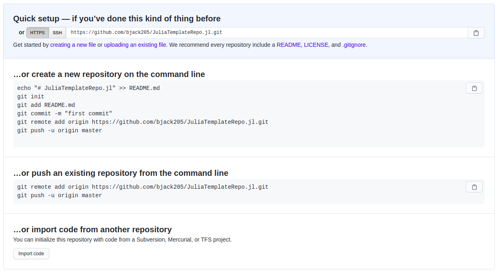

# Creating a New Package

This is a summary of the instructions in the [Julia Pkg manual](https://julialang.github.io/Pkg.jl/v1/creating-packages/#**5.**-Creating-Packages-1).

1. Create a new repository on GitHub:
    Follow the Julia package [naming conventions](https://julialang.github.io/Pkg.jl/v1/creating-packages/#Package-naming-guidelines-1). All julia package repos should have ".jl" at the end.
    Do NOT initialize the repo with a README or license at this point.

    

2. After creating the repo you should see a screen that looks like the one below. Copy the
    repo URL.

    

3. In your terminal on your computer, launch Julia. Generate the package files using the
    package manager:

        ] generate AlgamesPlots

    This will generate the `Project.toml` and a `src/AlgamesPlots.jl` files.

4. Create a `README.md`. Use whatever editor you prefer.

5. Create a git repo, add the remote, and push changes. These instructions are also found
    in the previous image.

        cd AlgamesPlots
        git init
        git add -A
        git commit -m "first commit"
        git remote add origin https://github.com/simon-lc/AlgamesPlots.jl.git
        git push -u origin master

6. (optional) Delete local files and add to Julia `dev` folder

        cd ..
        rm -rf AlgamesPlots

    Run Julia from your terminal and dev the package:

        ] dev https://github.com/simon-lc/AlgamesPlots.jl.git

    Alternatively, you can link to your local repository if you didn't delete it:

        ] dev /path/to/local/repo/AlgamesPlots
